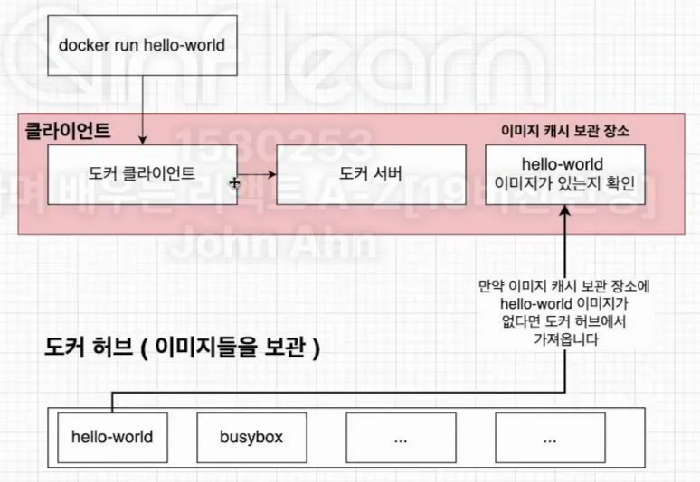
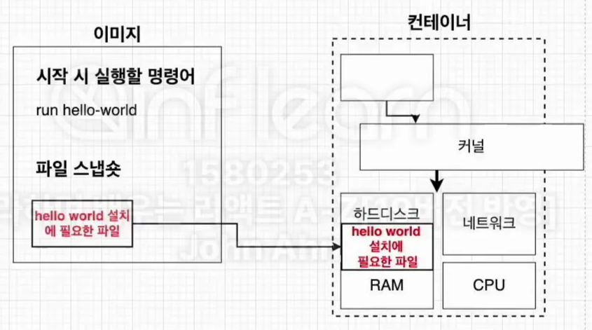
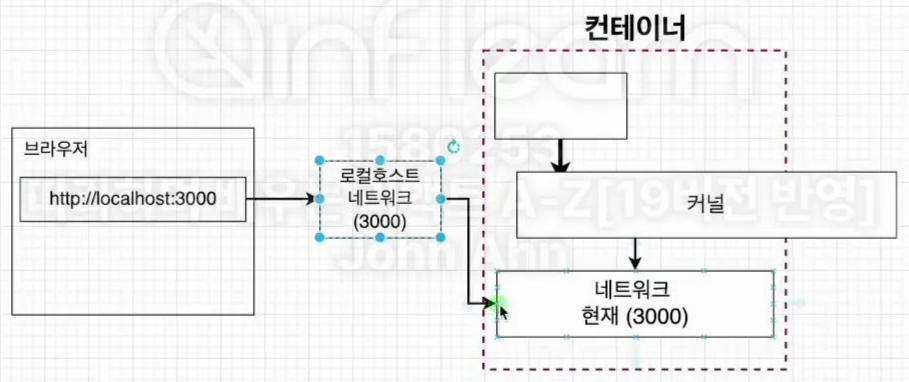

프로그램을 설치할 때 간단하게 설치할 수 있다.

<br></br>
### 도커

컨테이너를 사용하여 응용프로그램을 더 쉽게 만들고 배포하고 실행할 수 있도록 설계된 도구 이며, 컨테이너 기반의 오픈소스 가상화 플랫폼이며 생태계이다.

<br></br>
### 컨테이너

서버에서의 컨테이너는, 컨텡너 안에 다양한 프로그램, 실행환경을 컨테이너로 추상화하고 동일한 인터페이스를 제공하여 프로그램의 배포 및 관리를 단순하게 해준다.

일반 컨테이너의 개념에서 물건을 손쉽게 운송해주는 것 처럼 프로그램을 손쉽게 이동 배포 관리를 할 수 있게 해준다.

AWS, Azure, Google cloud 등 어디에서든 실헹 가능하게 해준다.

<br></br>
### 설치방법

google에 docker → 사이트 접속 후 윈도우 버전 다운로드 → 다운된 파일 실행해서 다음 버튼 눌러서 설치→ 컴퓨터 재시작 해주기 → `WSL 2 installation is incomplete.`라는 오류가 떠있다면 해결해야함. → 블로그 같은 곳에 해결법 나와있음. 파워셸에서 명령어 입력해서 무언가 설치. → 도커 재시작 → 해결 

<br></br>
### 도커의 사용 흐름

1. 도커 CLI에 명령어를 입력한다. 
    - CLI란 Command Line Interface로 텍스트 터미널을 통해 사용자와 컴퓨터가 상호 작용하는 방식을 뜻한다.
2. 도커 서버 (Deamon)이 해당 명령어를 받아서 이미지 생성 또는 컨테이너 실행 등의 작업을 수행한다. 



1. 도커 클라이언트에 커멘드를 입력 → 도커 클라이언트에서 도커 서버로 요청을 보냄
2. 도커 서버에서 커멘트로 받은 이미지가 로컬에 캐시 되어있는지 확인
3. 없다면 도커 허브라는 이미지가 저장되어 있는 곳에서 해당 이미지를 가져오고 로컬에 캐시로 저장
4. 있다면 해당 이미지를 이용해서 컨테이너 생성
5. 생성된 컨테이너는 이미지의 설정이나 조건에 따라 프로그램 실행

<br></br>
### 도커 이미지

도커 이미지는 컨테이너를 만들기 위해 필요한 설정이나 종속성들을 갖고 있는 소프트웨어 패키지이다. 

도커 이미지는 응용 프로그램이 실행하는데 필요한 모든 것을 포함하고 있다.



- 컨테이너가 시작될 때 실행되는 명령어
- 파일 스냅샷
    - 파일 스냅샷은 디렉토리나 파일을 카피한 것

도커 이미지는 도커 허브에 이미 다른 사람들이 만들어 놓은 것을 이용할 수도 있으며, 직접 도커 이미지를 만들어서 사용할 수도 있고 직접 만든것을 도커 허브에 업로드할 수 도 있다.

<br></br>
### 도커 이미지 생성

`docker create <이미지 이름>` 

1. 도커 파일 작성
    
    도커 파일이란 도커 이미지를 만들기 위한 설정 파일이다. 컨테이너가 어떻게 행동해야 하는지에 대한 설정을 의미한다. 
    
2. 도커 클라이언트
    
    도커 파일에 입력된 명령들이 도커 클라이언트에 전달된다.
    
3. 도커 서버
    
    도커 클라이언트에 전달된 모든 중요한 작업들을 수행하는 곳이다. 
    
4. 이미지 생성

<br></br>
### 도커 파일

도커 이미지를 만들기 위한 설정 파일이며, 컨테이너가 어떻게 행동해야 하는지에 대한 설정들을 정의해주는 곳이다. 

<br></br>
### 도커 파일 생성

도커 이미지가 필요한 것이 무엇인지를 생각하기

1. 베이스 이미지를 명시해준다. (파일 스냅샷에 해당)
2. 추가적으로 필요한 파일을 다운 받기 위한 몇 가지 명령어를 명시해준다. (파일 스냅샷에 해당)
3. 컨테이너 시작 시 실행될 명령어를 명시해준다. (시작 시 실행될 명령어에 해당)

```
# 베이스 이미지를 명시해준다.
FROM baseImage

# 추가적으로 필요한 파일들을 다운로드 받는다.
FUN command

# 컨테이너 시작시 실행 될 명령어를 명시해준다.
CMD ["executable"] 
```

- FROM RUN CMD 등은 도커 서버에게 무엇을 하라고 알려주는 것이다.
    - FROM : 이미지 생성시 기반이 되는 이미지 레이어이다. <이미지 이름>:<태그> 형식으로 작성한다. 태그를 안 붙이면 자동적으로 가장 최신것으로 다운 받는다. 
    ex) ubuntu:14.04
    - RUN : 도커 이미지가 생성되기 전에 수행할  쉘 명령어이다.
    - CMD : 컨테이너가 시작되었을 때 실행할 실행 파일 또는 쉘 스크립트이다. 해당 명령어는 DockerFile 내 1회만 쓸 수 있다.

<br></br>
### 베이스 이미지

- 도커 이미지는 여러개의 레이어들로 이루어져있다. 그 중에서 베이스 이미지는 이 이미지의 기반이 되는 부분이다.
- 레이어는 중간 단계의 이미지라고 생각하면 된다.

<br></br>
### 도커 파일로 도커 이미지 생성

도커 파일 → 도커 클라이언트 → 도커 서버 → 도커 이미지

도커 파일에 입력된 것들이 도커 클라이언트에 전달되어서 도커 서버가 인식하게 해야한다. 

  - 도커가 켜져있을 때 `docker build ./` 명령어 실행
  - build 명령어는 해당 디렉토리 내에서 dockerfile이라는 파일을 찾아서 도커 클라이언트에 전달시켜준다.

docker build ./로 생성한 이미지의 ‘writing image sha256’의 값 일부를 사용해서 이미지를 실행할 수 있다. 

ex) writing image sha256:c5cfab092f03c4682dr… 라면 `docker run c5cfab`로 실행할 수 있다.

<br></br>
### 리액트를 위한 도커 파일

원래는 개발 환경의 도커 파일, 운영 환경의 도커 파일을 작성한다.

- FROM → node: 16-alpine
- WORKDIR → /usr/src/app
    - 컨테이너의 어떤 경로에 리액트 파일을 넣을 건지 설정
- COPY → package.json ./
    - 해당 파일을 컨테이너로 복사
- RUN → npm install
    - package.json의 dependencies 패키지 설치
- COPY → ./ ./
    - 리액트 최상위 폴더내용을 컨테이너로 복사
    - 이때 리액트 최상위 폴더의 내용 중 nodemodules 폴더는 프로젝트 파일에서 지워줘서 다시 카피되는 것을 방지하기
- CMD → “npm”, “run”, “start”

dockerfile 생성 후 `docker build ./`로 이미지 생성하기

생성한 이미지의 sha256 코드로 도커 실행하기

<br></br>
### 도커 포트 맵핑 



브라우저의 포트와 컨테이너 내부의 네트워크 포트를 연결해줘야한다.

`docker run -p [포트번호]:[포트번호] [이미지코드]`

docker run -p 3000:3000 c5cfab

<br></br>
### EC2에서 도커 설치 및 실행 

1. 인스턴스 생서하기
    
    AWS 접속 후 EC2 메뉴에서 많이 사용하는 우분투 서버로 선택 (프리티어로 사용)
    
    검토 및 시작 선택
    
    키 페어를 RSA 유형으로 새롭게 생성 및 다운로드 (안전하게 보관하기)
    
    인스턴스 생성
    
2. 도커 연결하기
    
    인스턴스 생성 완료 후 연결 버튼 선택
    
    원래는 SSH로 연결하지만 간단하게 하기 위해서 EC2 인스턴스 연결 선택
    
    [DigitalOcean How To Install and Use Docker on Ubuntu](https://www.digitalocean.com/community/tutorials/how-to-install-and-use-docker-on-ubuntu-20-04)
    
3. EC2로 리액트 파일 가져가기
    
    방법1) 깃허브로 리액트 파일 올린 후에 EC2 인스턴스에서 Clone하기
    
    방법2) FTP를 이용해서 파일 올려주기 (Filezilla)
