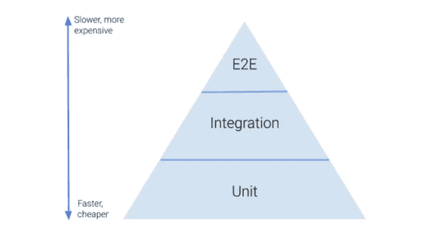
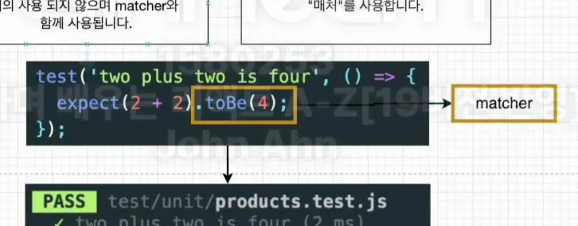
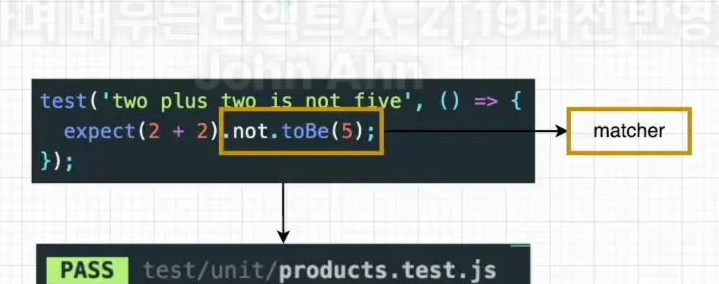
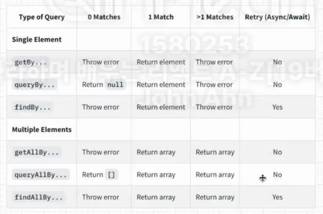
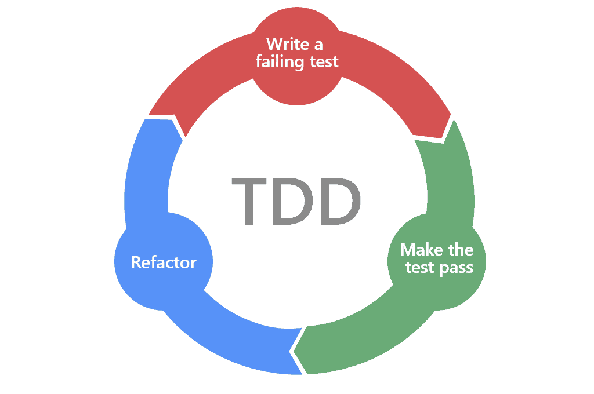

TDD는 실제 코드를 작성하기 전에 테스트 코드를 작성하고, 해당 테스트 코드를 통과할 수 있는 실제 코드를 작성하는 것이다. 

### TDD의 장점

- 기능을 테스트함으로써 소스 코드에 안정감이 부여된다.
- 디버깅 시간이 줄어들고 실제 개발 시간도 감소한다.

### Jest란?

- FaceBook에서 제작한 자바스크립트 테스트 프레임워크이다.
- 사용자는 Jest를 이용하여 테스트 코드를 작성한다.
- Jest는 Node.js 환경에서 실행되기 때문에 DOM이 없는데, DOM 없이는 React 컴포넌트 테스트가 불가능하다. 따라서 React Testing Library에서 제공하는 가상 DOM을 이용한다.
- CRA로 프로젝트를 생성한 경우 Jest를 지원하지만, 그렇지 않은 경우 별도로 설치가 필요하다.
    
    ⇒ 웹 브라우저가 아닌 환경은 window 전역 객체가 없는데, 따라서 DOM에 접근할 수 없으며 각 요소에 대한 접근과 조작이 불가능하다. 이를 가능한 것처럼 보이게 하는 것이 React Testing Library인데, 가상의 window 객체를 제공하기 때문이며 document.createElement 같은 구문도 동작이 가능하다. 
    
    브라우저에서 테스트하는 듯한 환경이 E2E 테스트와 비슷해보일 수 있지만 진짜 브라우저가 아니기 때문에 다르다. 
    

### React Testing Library란?

- [공식 문서](https://testing-library.com/docs/react-testing-library/intro/)
- RTL은 노드를 테스트하기 위한 library가 있는데, react를 테스트하기 위해 그 위에 api를 추가하여 구축하는 것이다.
- CRA로 프로젝트를 생성하면 React Testing Library를 지원하지만, 그렇지 않은 경우 별도로 설치가 필요하다.
- React Testing Library와 Enzyme의 차이점
    
    Enzyme은 에어비앤비에서 만들었으며, 구성 요소의 구현 세부 정보를 테스트한다.
    
    반면 React Testing Library은 개발자를 React 애플리케이션의 사용자 입장에 둔다는 차이가 있다.
    
    | 종류 | 차이점 |
    | --- | --- |
    | Enzyme | 구현 주도 테스트 (Implementation Driven Test) |
    | React Testing Library | 행위 주도 테스트 (Behavior Driven Test)  |

### E2E란?



테스트에는 다양한 종류가 있는데, 범위에 따라서 단위 테스트, 통합 테스트, E2E(End to End) 테스트로 구분할 수 있다.

- 단위 테스트(Unit Test)
    
    소스 코드의 특정 모듈이 의도된 대로 정확히 작동하는지 검증하는 절차다.
  즉, 모든 함수와 메소드에 대한 테스트 케이스를 작성하는 절차를 말한다.
    
    보통 레이어 단위(Controller, Service, Repository)로 혹은 특정 클래스에 대해서 정상적으로 동작하는지 확인하는 것으로
  핵심적인 테스트라고 할 수 있다.
    
- 통합 테스트(Integration Test)
    
    단위 테스트와 달리 개발자가 변경할 수 없는 부분 (외부 라이브러리, 데이터베이스) 까지 묶어서 같이 검증할 때 사용하는 테스트이다.
    
    보통 독립된 2개 이상의 모듈이 동시에 동작하는 경우에 테스트하며 모듈 간의 연결에서 발생하는 에러를 검증할 수 있다.
    
    단일 모듈이 복잡한 알고리즘이나 분기문을 가지고 있다면, 단위 테스트에 비해 테스트가 번거롭고, 테스트 중복이 발생할 확률이 높다.
    
- E2E(End To End) 테스트
    
    애플리케이션의 흐름을 처음부터 끝까지 테스트하는 것을 말한다.
    유닛 테스트나 통합 테스트의 각 모듈이 정상 동작함을 증명할 수 있지만,
  애플리케이션의 동작까지 모두 정상 동작하다는 것을 증명해 줄 수는 없다.
    
    실제 사용자의 사용 시나리오를 테스트함으로써 애플리케이션 동작을 테스트하고,
  이 테스트를 통과함으로써 애플리케이션이 제대로 동작함을 보장하는 것이다.
    
    가령 유저가 유저 정보를 조회한다고 하면, 계정을 등록하고, 로그인하는 과정이 먼저 수행되어야 한다.
    

### Jest 사용하기

- [설치 방법](https://velog.io/@yeong6415/Jest-%EC%84%A4%EC%B9%98-%EB%B0%8F-%EC%82%AC%EC%9A%A9%EB%B2%95)
    
    CRA에서 JS로 프로젝트 생성시 설치법이며, vite, typescript를 사용한다면 설치 방법과 필요 패키지가 달라진다. 
    
    1. `npm install --save-dev jest`로 Jest 설치
    2. package.json 파일의 scripts에 “test”: “jest” 확인
    3. 테스트하려는 파일 명은 @.test.js로 작성 
    4. 테스트 실행 `npm test`
- 추가 설정
    
    test 코드에 마우스 호버시 해당 메서드에 대해 알 수 있도록 추가설정하기
    
    1. `npm install --save-dev @types/jest` 설치
    2. jsconfig.json 파일 생성
    3. jsconfig.json에 다음과 같이 작성
        
        ```json
        {
        	"typeAcquisition": {
        		"include": ["jest"]
        	}
        }
        ```
        

### Jest 파일 구조

describe안에 test(it)가 여러개 작성되어 있고, test(it)는 expect와 matcher로 구성되어있다. 

- describe → argument(name, fn)
    
    여러 관련 테스트를 그룹화 하는 블록을 만든다.
    
- it (same as test) → argument (name, fn, timeout)
    
    개별 테스트를 수행하는 곳으로, 각 테스트를 작은 문장처럼 설명한다.
    
- expect
    
    expect 함수는 값을 테스트할 때마다 사용된다. expect 함수는 혼자서는 거의 사용되지 않으며 matcher와 함께 사용된다. 
    
- matcher
    
    다른 방법으로 값을 테스트하도록 “매처”를 사용한다. 
    
    - Test Matcher의 종류
        
        ```jsx
        toBe(a) // 예상한 값이 매개변수와 같은 값일 것인지 확인
        toEqual(obj) // 매개변수(객체)와 같은 값일 것이라 예상. 객체가 가진 값의 비교가 가능
        not.toBe(a) // 뒤의 결과를 부정하는 값과 비교
        
        toBeNull() // 예상한 값이 null 인지 확인
        toBeUndefined() // 예상한 값이 undefined 인지 확인
        toBeDefined() // 예상한 값이 undefined 가 아닌지 확인
        toBeTruthy() // 예상한 값이 truthy 한 값인지 확인
        toBeFalsy() // 예상한 값이 falsy 한 값인지 확인
        
        toBeGreaterThan(number); // number보다 큰 값인지 확인
        toBeGreaterThanOrEqual(number); // number보다 크거나 같은 값인지 확인
        toBeLessThan(number); // number보다 작은 값인지 확인
        toBeLessThanOrEqual(number); // number보다 작거나 같은 값인지 확인.
        toBeCloseTo(float) // float인 매개변수와 같은 값인지 확인합니다. 부동소수점 에러를 해결하기 위해 고안
        
        toMatch(string) // string을 포함하는 문자열인지 확인
        toContain('item') // item을 포함하는 배열(iterator)인지 확인
        
        toThrow() // 예외를 발생시키는지 확인
        ```
        




### 테스트 코드에서 render 함수와 screen 객체

DOM에 컴포넌트를 렌더링하는 함수이며, 인자로 렌더링할 React 컴포넌트가 들어간다. 

Return은 RTL에서 제공하는 쿼리 함수와 기타 유틸리티 함수를 담고 있는 객체를 리턴한다. (Destructuring 문법으로 원하는 쿼리 함수만 얻어올 수 있다.)

단, 소스 코드가 복잡해지면 render 함수보다 screen 객체를 이용하기를 권장한다. 

```jsx
// 지양하는 방법
test('renders learn react link', () => {
	const { getByText } = render(<App />); /* X */
	const linkElement = getByText(/learn react/i);
	expect(linkElement).toBeInTheDocument();
});

// 권장하는 방법
test('renders learn react link', () => {
	render(<App />);
	const linkElement = screen.getByText(/learn react/i); /* O */
	expect(linkElement).toBeInTheDocument();
});
```

### 쿼리 함수란?

쿼리는 페이지에서 요소를 찾기 위해 테스트 라이브러리가 제공하는 방법이다. 
여러 유형의 쿼리(’get’, ‘find’, ‘qeury’)가 있다. 이들 간의 차이점은 요소가 발견되지 않으면, 
쿼리에서 오류가 발생하는지 또는 Promise를 반환하고 다시 시도하는지 여부이다. 

- getBy
    
    쿼리에 대해 일치하는 노드를 반환하고, 일치하는 요소가 없거나 둘 이상의 일치가 발견되면 설명 오류를 발생시킨다. (둘 이상의 요소가 예상되는 경우에는 getAllBy 사용)
    
- findBy = getBy + waitFor
    - waitFor은 일정 기간 동안 기다려야 할 때 waitFor을 사용하여 기대가 통과할 때까지 기다릴 수 있다.
    
    주어진 쿼리와 일치하는 요소가 발견되면 Promise를 반환한다. 요소가 발견되지 않거나 기본 제한 시간인 1000ms 후에 둘 이상의 요소가 발견되면 약속이 거부된다. (둘 이상의 요소가 예상되는 경우에는 findAllBy 사용)
    
- queryBy
    
    쿼리에 대해 일치하는 노드를 반환하고 일치하는 요소가 없으면 null을 반환한다.
  이것은 존재하지 않는 요소를 어설션(Assertion**:** 코드에서 반드시 검증을 하고 넘어가야 할 상황이 있을때 사용 하는 비교 함수)하는 데
   유용하다. 둘 이상의 일치 항목이 발견되면 오류가 발생한다.
  (어설션이 확인된 경우 대신 queryAllBy 사용 → 쿼리에 일치하는 노드 배열을 반환하고, 일치하는게 없으면 빈 배열 반환)

  


### TDD, BDD, ATDD

[참고 글](https://velog.io/@suhongkim98/TDD-BDD-ATDD-%EC%95%8C%EC%95%84%EB%B3%B4%EA%B8%B0)

TDD는 테스트가 주도하는 개발 방법론으로 두 가지 규칙을 따른다.

1. 오직 자동화된 테스트가 실패한 경우에만 새로운 코드를 작성한다.
2. 중복을 제거한다.

TDD는 단위테스트가 아니다. 결과물이 단위테스트이다. 

즉, "비즈니스 로직을 먼저 구현하고 단위테스트를 작성하였더니 코드 설계, 모듈들 간에 의존성 등등에서 여러가지 문제점이 발생하여 유지보수가 점점 힘들어진다.. 이를 테스트를 먼저 작성하여 설계가 좋은 코드를 만들 수 있지 않을까?" 에서 시작된 것이 TDD이다. 



1. 먼저 실패하는 테스트코드를 작성한다. (RED)
    
    테스트코드를 돌려 실패가 뜨는 것을 확인한다. 컴파일 조차 안될 수 있다.
    
2. 테스트코드를 성공하기 위한 실제 코드를 작성한다. (GREEN)
    
    좋은 코드를 여기서 고민하지 않아도 된다. 테스트코드가 통과하기만 하면 된다.
    
3. 중복 코드 제거, 일반화 등의 리팩토링을 수행한다. (BLUE)
    
    블루 단계에서 리팩토링을 수행하여 중복을 제거한다.
    
이 과정을 반복한다.


#### 실제로 TDD는 많이 이루어지는가?

많은 개발자들이 대부분 장점에 공감하지만 실제 개발 단계에서 TDD가 잘 이루어지지는 않는다. 왜냐하면 테스트케이스 유지보수, 일정관리 관점에서 리소스 부담이 매우 크기 때문이다.

TDD에서 테스트케이스를 창작하고 고민하는 모든 것은 비용이다. 이미 작성된 요구사항이나 기획서가 바로 테스트케이스가 된다면 그런 관점에서 비용이 줄어들 것이다. 그것이 바로 BDD이다.

BDD(행위 주도 개발)는 TDD에서 파생된 개발 방법론이다.

> 코드를 작성하기 전에 코드가 수행할 행위에 대한 명세를 먼저 작성해야 한다고 하면 다들 쉽게 이것이 좋은 습관이라고 수긍하게 되지 않을까?
> 아직 존재하지 않은 코드에 대해 테스트를 작성하기 보다는, 행위에 대한 명세를 작성하는 것이라고 생각하면 직관적으로 쉽게 이해가 된다.
> 이것이 BDD의 핵심이다.
> 

BDD에서 주로 사용하는 디자인 패턴 : Given-When-Then Pattern

- Given : 시나리오 진행에 필요한 값을 설정한다.ex) 사용자가 로그인이 된 상태에서
- When : 시나리오를 진행하는데 필요한 조건을 명시한다.ex) 포인트 조회를 한다면
- Then : 시나리오를 완료했을 때 보장해야 하는 결과를 명시한다.ex) 사용자의 포인트가 보여진다.

#### ATDD(인수 테스트 주도 개발)는 사용자 시나리오 관점에서 정확한 요구 사항을 캡처하는 데 중점을 둔다.

구현 전에 사용자, 테스터 및 개발자가 인수 조건(Acceptance Criteria)을 정의한다. 이를 통해 모든 프로젝트 구성원이 수행해야 할 작업과 요구 사항을 정확히 이해할 수 있도록 도와준다.

#### 실제 개발 단계에서는 TDD, BDD, ATDD 중 하나만 선택하지 않고 필요한 부분에 같이 사용될 수 있다.
