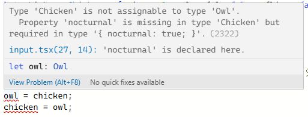
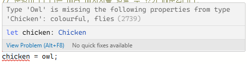
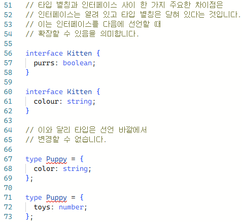

### typescript란?

마이크로소프트에서 구현한 JavaScript의 슈퍼셋 프로그래밍 언어이다. 

슈퍼셋은 특정한 언어의 모든 기능을 포함하면서 다른 기능까지 포함하도록 향상 또는 확장된 것을 의미한다. 
<br></br>

TypeScript라는 이름답게 정적 타입을 명시할 수 있다는 것이 순수한 자바스크립트와의 가장 큰 차이점이다. 

```jsx
const fruit = "apple";
const price = 4000;
```

자바스크립트에서 이렇게 작성했다면, 타입스크립트에서는 아래와 같이 작성해주는 것이다.

```tsx
const fruit: string = "apple";
const price: number = 4000;
```

즉, 자바스크립트에서의 자동 형변환 같은 다양한 타입을 유연하게 연산해주는 기능 사전에 차단하기 위함이라고 볼 수 있다.

<br></br>

### annotation & inference (주석 & 추론)

위의 예시처럼 타입을 직접 지정해주는 것을 type annotation이라고 한다.

그리고 타입스크립트가 코드를 해석하여 타입을 정의하는 동작을 type inference 라고 한다. 이는 변수 선언과 동시에 값으로 초기화 하는 경우만 일어난다. 

<br></br>

### narrowing & assertion (좁아짐 & 주장)

타입을 지정하기 애매해서 아래와 같이 union으로 여러 타입을 사용하는 경우가 있을텐데,

```tsx
function calAge(x : number | string) {
	return x + 1
}
```

이렇게 작성하게 되면 타입스크립트는 연산을 해주지 않는다.
<br></br>

typeof로 타입을 확인하는 narrowing 방법을 사용하거나 assertion 문법으로 타입을 확정해주어야 한다. 

```tsx
function calAge(x : number | string) {
	if (typeof x === 'string') {
		return x + '1';
	} else {
		let array : number[] = [];
		array[0] = x as number;
	}
}
```
<br></br>

assertion은 as 문법과 꺽쇠 괄호(<>) 문법이 있다.

리액트 사용시 꺽쇠 괄호는 JSX 문법과 겹치기 때문에 as 문법을 사용하는 것이 추천된다. 

```tsx
let text: any = "this is a string";

// as
let stringLength: number = (text as string).length;

// <>
let stringLength: number = (<string>text).length;
```
<br></br>

타입 지정에 as 문법과 : 방식이 있는데 어떻게 다른 것일까?

```tsx
interface Fruit {
	name: string;
	color: string;
	price: number;
}

// as
const fruit1 = {} as Fruit;
fruit1.name = 'apple';
fruit1.color = 'green';
fruit1.price = 1000;

// : 
const fruit2: Fruit = {
	name: 'banana',
	color: 'yellow',
	price: 2000,
}
```

첫 번째 방식은, 점진적으로 객체를 채울 수 있다. 

두 번째 방식은, 타입 선언과 동시에 객체를 할당하는 것으로 객체를 안전하게 만들 수 있다. 

<br></br>

### type & interface

타입을 생성하는 방법에는 두 가지 구문이 있다.

바로 type과 interface이다. 이 둘은 거의 비슷하게 동작하지만 확실히 차이점을 가지고 있다. 

또한 공식문서에서는 interface를 우선적으로 사용하고, 특정 기능이 필요할 때 type을 사용하기를 권장한다.
<br></br>

첫 번째로, type 대신 interface를 사용할시 더 나은 오류 메시지를 반환해준다. 

```
// 사전 설명
Owl은 type으로 선언되어 wings, nocturnal 값을 가진다.
Chicken은 interface로 선언되어 wings, colorful, files 값을 가진다.
```



위 오류는 Owl 타입으로 선언된 owl 객체의 오류 메시지이다. 
Owl 타입에는 wings와 nocturnal 값이 있어야 하는데, 
현재 할당중인 chicken 객체에는 nocturnal 값이 없다는 의미를 담고있다.



위 오류는 Chicken 타입으로 선언된 chicken 객체의 오류 메시지이다. 
Chicken 타입에는 wings, colorful, files 값이 있어야하는데, 
현재 할당 중인 owl 객체에는 colorful, files 값이 없다는 의미를 담고있다.
<br></br>

결국 같은 형식의 오류 메시지를 담고 있는데, 확실히  interface로 작성된 오류 메시지가 가독성이 좋다. 
<br></br>

두 번째로, interface는 type과 달리 선언 바깥에서 확장이 가능하다.


