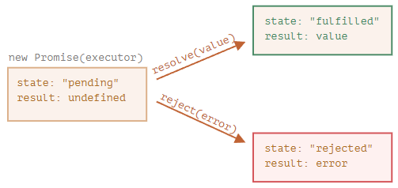

async와 await은 비동기를 동기처럼 동작하게 하는 기능입니다.
<br></br>

async와 await이 나오려면 먼저 callback과 promise를 알아야하는데요, 

우선 동기와 비동기가 무엇인지 설명을 해보겠습니다. 

- 동기 : 동시에 일어난다는 의미. 요청과 결과가 동시에 일어난다. 요청을 하면 시간이 얼마나 걸리던지 요청한 자리에서 결과가 주어져야 한다.
- 비동기 : 동시에 일어나지 않는다. 요청과 결과가 동시에 일어나지 않는다. 하나의 요청에 따른 응답 대기 시간 동안 다른 요청에 대해 처리가 가능한 방식이다.

카페로 예를 들자면,
동기는 손님 a로부터 주문을 받고 커피를 내주기까지 다음 손님 b, c 등등을 받지 않는 것이고,
비동기는 손님 a, b, c 등등의 주문을 순차적으로 미리 받아두고 만들어지는 순서대로 음료를 내주는 것입니다. 
그래서 a가 제조가 오래 걸리는 [피스타치오 헤이즐 프라푸치노]를 먼저 주문했다고 하더라도 b가 [아이스 아메리카노]를 주문했다면, 
b의 아아가 먼저 나오는 것.
<br></br>

자바스크립트 자체는 동기(synchronous)언어 입니다. 
하지만 자바스크립트가 동작하는 환경(브라우저나 node.js 등)이 비동기 작업을 지원하고, 
그 결과를 자바스크립트에 전달하기 때문에, 자바스크립트는 비동기를 핸들링해야하는 겁니다. 
<br></br>

자, 그렇다면 아래 코드는 오류가 발생할까요, 정상 작동할까요?

```jsx
function loadScript(src) {
  // <script> 태그를 만들고 페이지에 태그를 추가합니다.
  // 태그가 페이지에 추가되면 src에 있는 스크립트를 로딩하고 실행합니다.
  let script = document.createElement('script');
  script.src = src;
  document.head.append(script);
}

loadScript('/my/script.js'); // script.js엔 "function newFunction() {…}"이 있습니다.

newFunction();
```
<br></br>

위의 코드를 설명하자면, js 파일을 로드하는 loadScript 함수가 정의되어있고, 해당 함수를 호출합니다. 
그리고 js 파일에 정의 되어있는 newFunction을 호출합니다.
<br></br>

하지만 위의 코드는 ‘newFunction(); 함수가 존재하지 않는다‘는 에러가 발생하는데요.
<br></br>

이유는, 자바스크립트는 기본적으로 동기적이지만,

외부 지원 로딩(예를 들어서 script 태그로 js 불러오기)은 비동기적으로 작동합니다.
<br></br>

즉, 동기 코드처럼 보이지만, 내부적으로 비동기 동작을 유발하기 때문이에요.

(위의 예시 같은 경우에는 스크립트가 아직 불러오는 중인데 newFunction을 호출했다면 오류가 나는게 당연하겠죠?)
<br></br>

### 첫 번째 방법) callback 함수

callback 함수는 useState 같이 진짜 있는 함수의 이름이 아니라 ‘역할 이름’이 callback이에요. 

어떤 함수가 다른 함수에 인자로 전달돼서 특정 시점에 실행되는 역할을 하는데요.

```jsx
// 함수 선언 부분
function loadScript(src, callback) {
  let script = document.createElement('script');
  script.src = src;

  script.onload = () => callback(null, script);
  script.onerror = () => callback(new Error(`${src}처리 중 에러가 발생`));

  document.head.append(script);
}

// 함수 호출 부분
loadScript('/script.js', (error, script) => {
  if (error) {
    // 에러 처리
  } else {
    // 스크립트 로딩이 성공적으로 끝남
  }
});
```
<br></br>

- 함수 선언과 함수 호출할 때의 인자 개수가 다른데요?
    
    자바스크립트는 함수를 호출할 때 넘겨주는 인자 개수와, 함수 선언 시 받는 인자 개수가 달라도 오류가 나지 않습니다. 
    
    즉, 함수 <호출> 부분에서 아래처럼 작성해도 오류가 안 난다는 의미입니다. 
    
    ```jsx
    // 두 번째 인자 안 씀 -> undefined로 들어감 
    loadScript('file.js', (err) => {
      if (err) {
        console.error('에러 발생!', err);
      } else {
        console.log('성공!');
      }
    });
    
    // 선언 안 한 세 번째 인자까지 작성 -> musi는 무시됨 
    loadScript('/script.js', (error, script, musi) => {
      if (error) {
        // 에러 처리
      } else {
        // 스크립트 로딩이 성공적으로 끝남
      }
    });
    ```
    
<br></br>

하지만 비동기 동작이 많아지면 아래 코드처럼 핸들링이 힘들어집니다.

```jsx
loadScript('1.js', function(error, script) {

  if (error) {
    handleError(error);
  } else {
    // ...
    loadScript('2.js', function(error, script) {
      if (error) {
        handleError(error);
      } else {
        // ...
        loadScript('3.js', function(error, script) {
          if (error) {
            handleError(error);
          } else {
            // 모든 스크립트가 로딩된 후, 실행 흐름이 이어집니다. (*)
          }
        });

      }
    })
  }
});
```
<br></br>

### 두 번째 방법) Promise

promise는 자바스크립트의 객체입니다. 

따라서 `new Promise`로 객체를 만들 수 있고, resolve와 reject를 가집니다.



사진에서 보이다시피 state가 처음에는 pending이었다가, 

resolve가 호출되면 fulfilled가 되고, reject가 호출되면 rejected가 됩니다. 
<br></br>

훨씬 간단해졌죠? 

여기서 끝이 아니에요.

then, catch, finally가 있거든요.
<br></br>

```jsx
// Promise 안에서는 resolve와 reject 중 단 하나만 유효하게 실행됨

let promise = new Promise((resolve, reject) => {
	resolve("성공!"); // 성공
  reject("실패!"); // 무시됨
});
```

이렇게 promise 객체를 만들면 아래처럼 then이 받습니다. 

```jsx
// 이 예시처럼 then을 이어서 사용하는게 promise chaining

promise
	.then(첫 번째 인자 - resolve일때 , 두 번째 인자 - reject일때)
	.then(
		(result) => {
			console.log("then 성공:", result); // 이거 실행됨
		},
		(error) => {
			console.log("then 실패:", error);  // 이거는 실행 안 됨
		}
	);
```
<br></br>

그런데 then의 [첫 번째 인자]에서 일어난 예외는 [두 번째 인자]에서 못 잡기 때문에,

catch를 오류를 잡는데 사용합니다.

(`promise.then(success, failure)` 이거는 옛날 스타일..)

```jsx
promise
	.then(res=> {
	  return res; // promsie에서 resolve 되면
	})
	.then(result => {
	  console.log("then:", result); // 위에 then에서 return한 값 받음 
	})
	.catch((err) => {
		console.log("catch:", err); // promsie에서 resolve 되면 or then에서 예외 발생하면 
	});
```
<br></br>

(finally 설명은 생략)
<br></br>

### 세 번째 방법) async와 await

우선 각각 어디에 사용하는지 간단하게 설명하자면,

- async : 함수(명) 앞에 쓰임
- await : async 안에서 쓰임
<br></br>

그런데 이때 주의할 점이 있습니다.

async는 promise를 무조건 반환한다는 것과

await은 반드시 promise를 반환하는 함수나 표현식 앞에 써야한다는 것입니다.
<br></br>

일단 async가 무조건 promise를 반환하는 이유는, 

내부에서 사용하는 await이 promise를 다루기 때문입니다.
<br></br>

그럼 왜 await은 promise를 반환하는 함수나 표현식 앞에 써야할까요?

그건 await이 promise의 resolve나 reject를 기다리기(비동기로 처리되는 애들을 기다림) 때문입니다.

비동기로 처리되지 않는 동기로 처리되는 것을 기다릴 이유는 없잖아요? (기다려도 효과없음)
<br></br>

그럼 [async와 await] 얘네는 promise를 가졌으니, then과 catch을 함께 사용하면 되겠군요?
<br></br>

맞는 말이에요. 

그런데 async와 await에게는 [then, catch] 외에도 새로운 친구가 있는데요, [try, catch]입니다. 
<br></br>

- [then, catch] : async 외부에서 사용
- [try, catch] : async 내부에서 사용
<br></br>

따라서 try-catch를 사용했다면 밖에서 굳이 then-catch를 사용할 이유가 없는거에요. 
<br></br>

아래 코드로 예시를 볼게요. 

```jsx
// async 함수 밖: then-catch (안에서 try-catch 안 했을때)
getAnswer()
  .then(a => console.log(a))
  .catch(err => console.error(err));

// async 함수 안: async-await + try-catch
const getAnswer = async() => {
  try {
    const a = await fetchData();
    console.log(a);
  } catch (err) {
    console.error(err);
  }
}

getAnswer(); // 이건 함수 선언 이었기 때문에 호출이 필요함

```
<br></br>

> 참고 자료

[promise와 async, await](https://ko.javascript.info/async)
