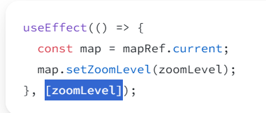

### 컴포넌트가 화면에 표시되기까지
(초기 렌더링 1회) > 렌더링 트리거 > 렌더링 (react에서 컴포넌트 호출) > 커밋 (렌더링 후 변경사항 DOM에 반영) > 페인팅(브라우저 페인트) (DOM 업데이트 후 화면 다시 그리기)

### 언제 사용하는가
 React 코드(다른 상태에 기반한 일부 상태를 조정하는 경우)를 벗어난 특정 외부 시스템(브라우저 API, 서드 파티 위젯, 네트워크 등)과 동기화 할 때

### 실행되는 시점
컴포넌트가 렌더링 될 때마다 실행되는데, 커밋 후 페인팅까지 진행된 다음 내부의 코드를 실행시키기 때문에 화면이 두 번 바뀌는 것 같은 느낌을 받을 수 있다. 

따라서 무언가의 렌더링이 완료된 후 DOM 변경 등의 조작이 필요할 때 적합하다. 

### 의존성

(드래그 된 부분이 의존성 부분이다.)

useEffect는 렌더링이 발생할 때마다 실행된다. 따라서 이를 방지하기 위해서는 두 번째 인자로 [ ]를 통한 의존성을 지정해 주어야하는데, 의존성을 빈 배열로 두더라도 반드시 대괄호를 작성해주어야 항상 실행되는 것을 방지하고 마운트될 때만 실행되게 할 수 있다. 

그리고 배열 안에 변수 명을 입력할 경우, (초기 렌더링 외에도) 해당 변수가 변경될 때도 실행되게 할 수 있다. 

### useEffect의 clean up 함수
React에서는 Effect가 다시 실행되기 전마다 클린업 함수를 호출하고, 컴포넌트가 마운트 해제(제거)될 때에도 마지막으로 호출한다.

### 참고
[React useEffect 공식문서](https://ko.react.dev/reference/react/useEffect)
