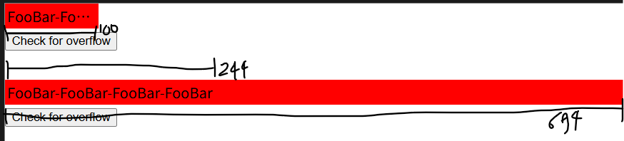
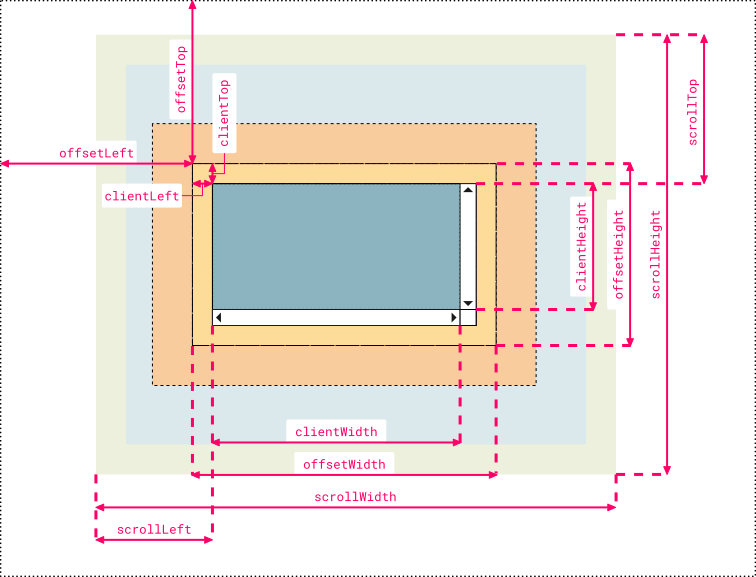

window.innerWidth는 브라우저 창의 가로 길이를 의미한다.

따라서 가로 스크롤을 구현할 때 사용하기도 한다.

``` javascript
document.getElementById(id).scrollLeft += / -= window.innerWidth;
```

---

[MDN element:scrollLeft 공식문서](https://developer.mozilla.org/en-US/docs/Web/API/Element/scrollLeft)

문서에 따르면 scrollLeft는 요소의 콘텐츠 왼쪽 가장자리에서 스크롤되는 픽셀수를 가져오거나 설정한다.

비슷하게 scrollTop은 요소의 상단 가장자리의 픽셀수이다.

---

scrollWidth도 화면에 보이는 요소의 길이를 나타내는데 단, overflow 되었을 경우 스크롤이 될 수 있는 길이를 최소 길이로 시작한다.

scrollHeight도 세로 방향으로 같다.



이 그림에서 위의 빨간 박스는 scrollWidth가 244이고 아래는 694이다.

clienWidth는 위의 박스가 100이고 아래가 694이다.

---

clientWidth는 overflow된 값을 무시한 화면에 딱 보이는 요소의 가로 길이다. 

clientHeight는 같은 의미의 세로 길이다.

---

이 외에도 clientTop, offsetTop, cssHeight 등이 있으며 다음 사진과 사이트에서 확인할 수 있다.



[clientTop, offsetTop 등을 확인할 수 있는 사이트](https://jsfiddle.net/y8Y32/25/)
