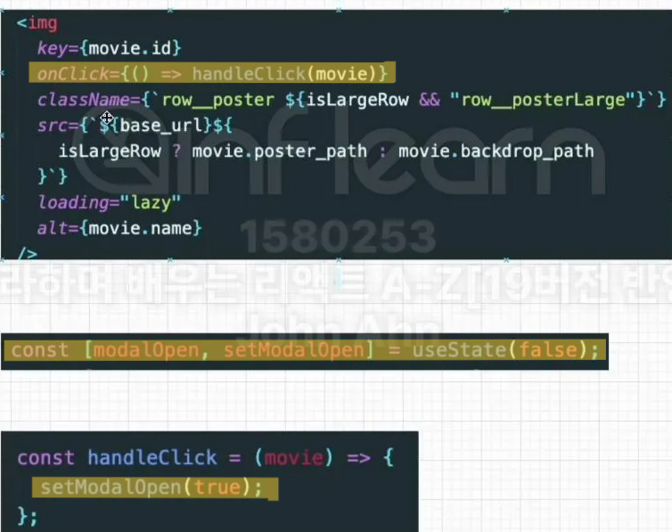
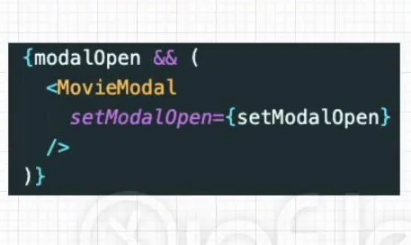
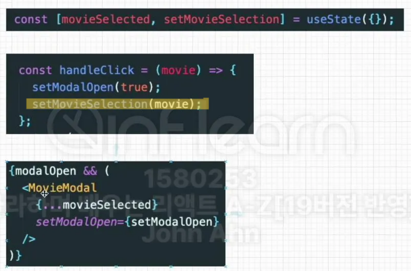

1. 모달의 상태를 useState에 담아두고 요소 클릭시 onClick을 이용해서 모달의 상태를 true로 설정해준다.

  

  그러면 아래처럼 modalOpen  상태변수가 true일 때만 MovieModal 컴포넌트가 보일 수 있게 된다.

  

2. 모달에 선택된 특정 데이터를 넘겨주는 것은 요소를 클릭했을 때 발생한 onClick 함수에서 함께 처리하는데,
   아래처럼 데이터를 담을 useState를 만들고 상태변경함수로 데이터를 담아준 후 MovieModal 컴포넌트에 props로 전달하면 된다. 

  

---

요약하자면 useState를 통해서 모달의 boolean과 선택된 데이터를 관리하면 된다.
